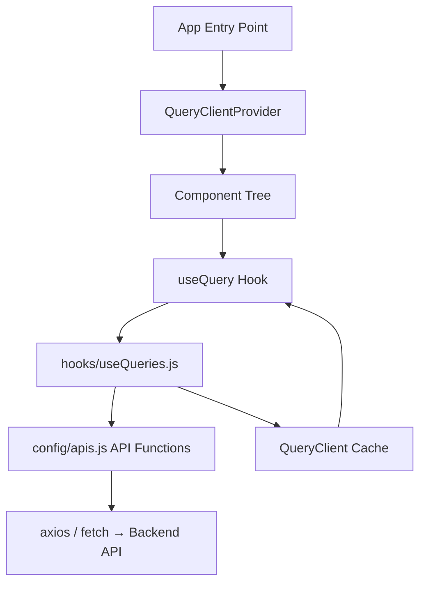

# Design Document: TanStack Query Integration

## Overview

This design covers the integration of TanStack Query (v5) into the React Native app. The goal is to wrap every GET API function in `config/apis.js` with a `useQuery`-based custom hook, delivering automatic caching, background refetching, loading/error states, and cache invalidation support — all without touching the existing API layer.

All hooks are delivered in a single file: `hooks/useQueries.js`. The file exports a configured `QueryClient`, a `QUERY_KEYS` constant, and 48 named hook exports (34 non-parameterized, 14 parameterized).

The `QueryClientProvider` wraps the root component tree so every hook shares the same cache.

---

## Architecture



The data flow is unidirectional: components call hooks → hooks call API functions → responses are stored in the QueryClient cache → components re-render with fresh data. Mutations in components call `queryClient.invalidateQueries` using keys from `QUERY_KEYS` to trigger background refetches.

---

## Components and Interfaces

### QueryClient (exported singleton)

```js
// hooks/useQueries.js
export const queryClient = new QueryClient({
  defaultOptions: {
    queries: {
      staleTime: 300_000, // 5 minutes
      retry: 2,
    },
  },
});
```

### QueryClientProvider wiring

```jsx
// App.js (or root entry)
import { QueryClientProvider } from '@tanstack/react-query';
import { queryClient } from './hooks/useQueries';

export default function App() {
  return (
    <QueryClientProvider client={queryClient}>
      {/* rest of app */}
    </QueryClientProvider>
  );
}
```

### QUERY_KEYS constant

```js
export const QUERY_KEYS = {
  userWho: 'userWho',
  userData: 'userData',
  userNotifications: 'userNotifications',
  unseenNotificationsCount: 'unseenNotificationsCount',
  membershipNumber: 'membershipNumber',
  allHalls: 'allHalls',
  hallReservations: 'hallReservations',
  hallLogs: 'hallLogs',
  hallVoucher: 'hallVoucher',
  allPhotoshoots: 'allPhotoshoots',
  availablePhotoshoots: 'availablePhotoshoots',
  availableLawns: 'availableLawns',
  lawnCategories: 'lawnCategories',
  lawnNames: 'lawnNames',
  lawnReservations: 'lawnReservations',
  lawnLogs: 'lawnLogs',
  lawnsByCategory: 'lawnsByCategory',
  timerVouchers: 'timerVouchers',
  vouchers: 'vouchers',
  voucherByType: 'voucherByType',
  affiliatedClubs: 'affiliatedClubs',
  affiliatedClubRequests: 'affiliatedClubRequests',
  ads: 'ads',
  events: 'events',
  rules: 'rules',
  aboutUs: 'aboutUs',
  clubHistory: 'clubHistory',
  dashboardStats: 'dashboardStats',
  sports: 'sports',
  allCalendarData: 'allCalendarData',
  calendarRooms: 'calendarRooms',
  calendarHalls: 'calendarHalls',
  calendarLawns: 'calendarLawns',
  calendarPhotoshoots: 'calendarPhotoshoots',
  hallRule: 'hallRule',
  roomRule: 'roomRule',
  lawnRule: 'lawnRule',
  photoshootRule: 'photoshootRule',
  messingCategory: 'messingCategory',
  messingItemsByCategory: 'messingItemsByCategory',
  messingSubCategories: 'messingSubCategories',
  messingItemsBySubCategory: 'messingItemsBySubCategory',
  currentAdmin: 'currentAdmin',
  authAdmins: 'authAdmins',
  adminReservations: 'adminReservations',
  feedbackCategories: 'feedbackCategories',
  feedbackSubCategories: 'feedbackSubCategories',
  feedbacks: 'feedbacks',
};
```

### Non-parameterized hook pattern

```js
export const useGetAllHalls = () =>
  useQuery({
    queryKey: [QUERY_KEYS.allHalls],
    queryFn: banquetAPI.getAllHalls,
  });
```

### Parameterized hook pattern

```js
export const useGetHallReservations = (hallId) =>
  useQuery({
    queryKey: [QUERY_KEYS.hallReservations, hallId],
    queryFn: () => banquetAPI.getHallReservations(hallId),
    enabled: hallId != null,
  });
```

The `enabled: param != null` guard prevents firing when the parameter has not yet been resolved (e.g., during navigation or async data loading).

---

## Data Models

### Hook return shape (from `useQuery`)

Every hook returns the standard TanStack Query result object:

| Field | Type | Description |
|---|---|---|
| `data` | `any \| undefined` | API response when successful |
| `isLoading` | `boolean` | `true` while the first fetch is in flight |
| `isFetching` | `boolean` | `true` during any fetch (including background) |
| `isError` | `boolean` | `true` after all retries are exhausted |
| `error` | `Error \| null` | The thrown error object on failure |
| `refetch` | `() => void` | Triggers a manual re-fetch |

### Query key shapes

| Hook | Query Key |
|---|---|
| Non-parameterized | `[QUERY_KEYS.<key>]` |
| Single param | `[QUERY_KEYS.<key>, param]` |
| Multi-param | `[QUERY_KEYS.<key>, param1, param2, ...]` |

---

## Correctness Properties

*A property is a characteristic or behavior that should hold true across all valid executions of a system — essentially, a formal statement about what the system should do. Properties serve as the bridge between human-readable specifications and machine-verifiable correctness guarantees.*

### Property 1: Every hook delegates to its API function

*For any* hook in `hooks/useQueries.js`, when the hook is rendered and the query runs, the underlying API function from `config/apis.js` SHALL be called exactly once per fetch.

**Validates: Requirements 2.4**

### Property 2: Parameterized hooks include params in query key

*For any* parameterized hook and any set of non-null parameter values, the query key used by TanStack Query SHALL contain each parameter value as an element of the key array, in the order specified.

**Validates: Requirements 3.2, 5.1–5.14**

### Property 3: Null/undefined params disable parameterized queries

*For any* parameterized hook, when any required parameter is `null` or `undefined`, the hook SHALL NOT call the underlying API function (query is disabled).

**Validates: Requirements 5.15**

### Property 4: Successful fetch exposes data and clears loading

*For any* hook and any valid API response value, after the query resolves successfully, the hook SHALL expose `isLoading: false` and `data` equal to the value returned by the API function.

**Validates: Requirements 6.1, 6.2**

### Property 5: Failed fetch exposes error state

*For any* hook, when the underlying API function throws an error after all retries, the hook SHALL expose `isError: true` and `error` equal to the thrown error object.

**Validates: Requirements 6.3**

### Property 6: refetch triggers a new API call

*For any* hook in a resolved state, calling the returned `refetch` function SHALL invoke the underlying API function again.

**Validates: Requirements 6.4**

---

## Error Handling

- **Network errors**: TanStack Query retries up to 2 times (configured via `retry: 2`). After exhausting retries, `isError` becomes `true` and `error` holds the rejection value.
- **Null parameter guard**: Parameterized hooks use `enabled: param != null` to silently skip fetching rather than making a bad API call. Components should check `isLoading` and `data` before rendering.
- **API function errors**: The existing API functions in `config/apis.js` already handle and re-throw errors. The hooks do not add additional error transformation — they surface whatever the API function throws.
- **No changes to apis.js**: Error handling in the API layer remains unchanged. The hooks are purely a caching/state-management wrapper.

---

## Testing Strategy

### Unit tests (example-based)

- Verify `queryClient` is exported and is a `QueryClient` instance with `staleTime: 300000` and `retry: 2`.
- Verify `QUERY_KEYS` is exported and contains all 48 expected keys.
- Verify all 48 hooks are exported as functions from `hooks/useQueries.js`.
- Verify `QueryClientProvider` wraps the root component tree (smoke test via React Testing Library).

### Property-based tests

Using a property-based testing library (e.g., `fast-check` for JavaScript):

**Property 1 — Hook delegates to API function**
Tag: `Feature: tanstack-query-integration, Property 1: every hook delegates to its API function`
- Generate: a random hook from the 48 hooks, mock its API function
- Assert: mock was called after rendering the hook
- Minimum 100 iterations

**Property 2 — Parameterized query key contains params**
Tag: `Feature: tanstack-query-integration, Property 2: parameterized hooks include params in query key`
- Generate: random non-null values for each parameterized hook's parameters
- Assert: the active query key array contains each generated value
- Minimum 100 iterations

**Property 3 — Null params disable query**
Tag: `Feature: tanstack-query-integration, Property 3: null/undefined params disable parameterized queries`
- Generate: null or undefined for each parameter slot of each parameterized hook
- Assert: the underlying API mock is never called
- Minimum 100 iterations

**Property 4 — Successful fetch exposes data**
Tag: `Feature: tanstack-query-integration, Property 4: successful fetch exposes data and clears loading`
- Generate: random response objects from the mocked API function
- Assert: `data` equals the generated response, `isLoading` is false
- Minimum 100 iterations

**Property 5 — Failed fetch exposes error**
Tag: `Feature: tanstack-query-integration, Property 5: failed fetch exposes error state`
- Generate: random error objects thrown by the mocked API function
- Assert: `isError` is true, `error` equals the generated error
- Minimum 100 iterations

**Property 6 — refetch triggers new API call**
Tag: `Feature: tanstack-query-integration, Property 6: refetch triggers a new API call`
- Generate: any hook in resolved state
- Assert: calling `refetch()` increments the mock call count by 1
- Minimum 100 iterations

### Integration tests

- Caching: verify that within `staleTime`, a second hook render does not trigger a second API call.
- Stale-while-revalidate: verify that after `staleTime` expires, stale data is returned immediately while a background fetch runs.
- Cache invalidation: verify that `queryClient.invalidateQueries({ queryKey: [QUERY_KEYS.someKey] })` triggers a refetch for active subscribers.
- Mount/unmount/remount: verify cached data is served on remount within the cache window.
